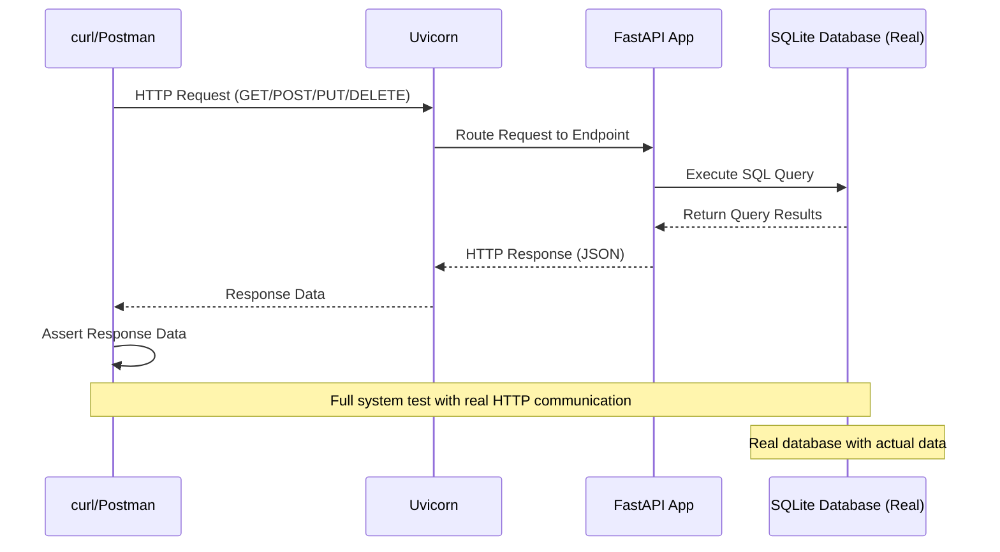
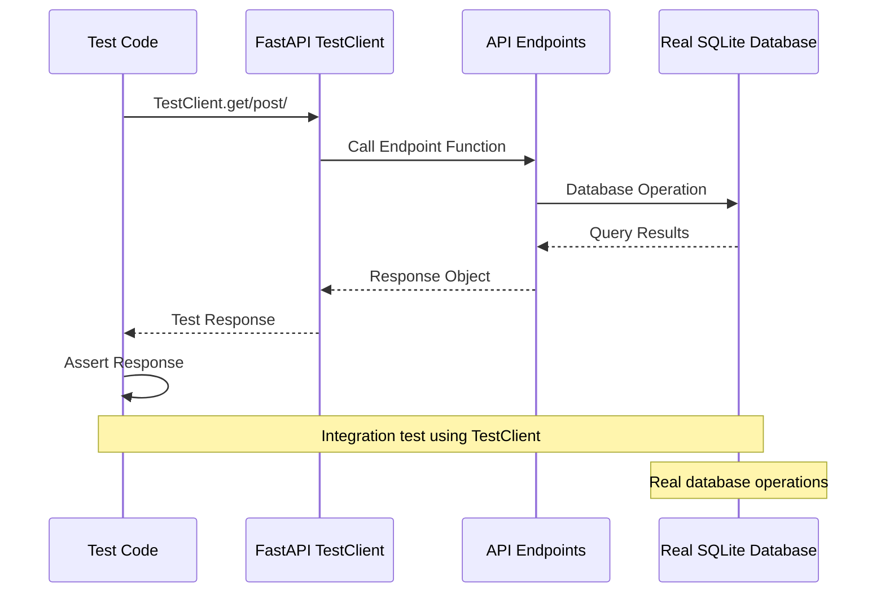

# InvParser App - API Testing 

In this task you'll write API tests for the InvParser API endpoints.

## Background: Test design 

As a reminder, **test design** is the process of choosing the strategy and approach for testing our app.

#### End-to-end (manual) testing

In the previous project, you tested your endpoints **manually** using `curl` or Postman, while the app was running locally in the background.
This strategy is known as **end-to-end testing**, because you, as a tester, interact with the app just like a real user would do. And the app is fully running, as a whole, with all its components (database, external OCI service communication, etc...).



Let's explore another common strategy:

#### Integration test 

In this approach we test the API endpoint, while interacting with a real database. 
This is why it's called an **integration test** - we test the integration between the API layer and the database layer.

Note that we **don't** run a real app server (like Uvicorn) in this approach, alternatively, we use FastAPI's `TestClient` to simulate HTTP requests to the API endpoints. 
We also **mock the OCI Document AI service calls**, so we don't depend on external services during the test.



Example for test case template can be (**you should modify it to make it work**):

```python
import unittest
from unittest.mock import patch, MagicMock
from db_util import init_db, clean_db
from fastapi.testclient import TestClient
from app import app


class TestYourFeature(unittest.TestCase):
    """Integration test for ........."""
    
    def setUp(self):
        """Set up before each test method"""
        init_db()
        
        # TODO insert test data into the database, as if they were created by previous API calls
        
    
    def tearDown(self):
        """Clean up after each test method"""
        clean_db()   # To be implemented by you... 
    
    @patch('oci.ai_document.AIServiceDocumentClient')
    @patch('oci.config.from_file', return_value={})
    def test_endpoint_success_case(self, mock_config, mock_client_class):
        """Test successful request to endpoint"""
        
        # Create test client (simulates HTTP requests without running server)
        client = TestClient(app)
        
        response = client.get("/some-endpoint")
        
        # Assert response status
        self.assertEqual(response.status_code, 200)
        
        # Assert response data structure
        result = response.json()
        

if __name__ == '__main__':
    unittest.main()
```

## Guidelines

### Test plan

Write a short test plan document (in `tests/API_TEST_PLAN.md`) with the following structure:

1. What to test - which API endpoints and functionalities you plan to test. 
2. Test design strategy - how you plan to test the API (e.g. which testing framework, etc...). You are required to choose the **integration test** strategy described above.
3. Test environment - where you plan to run the tests (e.g. locally, GitHub Actions CI, etc...)
4. Success criteria - how you will determine if the tests are successful - your success criteria must be **100% API endpoint coverage**, and as close as possible to 100% **code coverage** of the API code.
5. Reporting - how you plan to report the test results (see below).

### Implementation

1. From an up-to-date `main` branch, create a new branch `feature/api_integration_test` for your work.
2. Implement the below tests to the InvParser API.
3. Commit your changes and push the `feature/api_testing` branch to your remote repository.
4. Create a pull request from `feature/api_integration_test` to `main` branch once you are done with the implementation.
5. Let the PR pass the Continues Integration (CI) checks. **Don't** merge it yet.

### API endpoints reporting

Write a document called **Traceability Matrix** in `tests/API_TRACEABILITY_MATRIX.md` that maps each API endpoint to the corresponding test cases you have implemented.


### Code coverage reporting

Good test reporting helps you track code quality and see test results directly in GitHub. 
You'll set up automated test reporting that shows coverage percentages and test results in your pull requests.

1. Install testing dependencies in your `requirements.txt`:
   ```
   pytest
   pytest-cov
   pytest-html
   ```

2. Add pytest configuration file in `pytest.ini`:
   ```ini
   [pytest]
   addopts = --cov=app --cov-report=html --cov-report=xml --cov-report=term-missing
   ```
   This tell `pytest` to generate **code coverage reports** for the `app.py` module.

3. You can now run tests simply by:
   ```bash
   pytest test/
   ```
4. To generate a comprehensive HTML report, run:
    ```bash
    coverage html
    ```
    This will create a `htmlcov/` directory with an `index.html` file that you can open in a web browser to see detailed coverage reports.

5. Create a nice code coverage reporting view in GitHub using the `codecov` action. 
   - Open account on [Codecov](https://codecov.io/) and link it to your GitHub repository.
   - Add the following step to your `.github/workflows/test.yml` file:

     ```diff
        - name: Run tests
          run: |
            pytest test/ -v
         
     +  - name: Upload coverage to Codecov
     +    uses: codecov/codecov-action@v3
     +    with:
     +      file: ./coverage.xml
     +      fail_ci_if_error: true
     ```

   

# Submission

1. Once your pull request is ready and CI checks have passed, request a review from your course trainer.
2. After approval, merge the PR into `main`.
3. Prepare a short 5 minutes presentation of your work.
   - The demo must be **live**, i.e. you will show how tests are pass, and code coverage is reported in GitHub.
   - Be ready to answer questions.


# Good luck!
